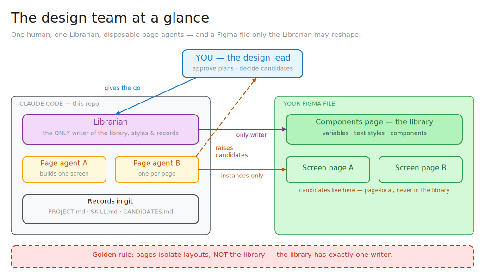
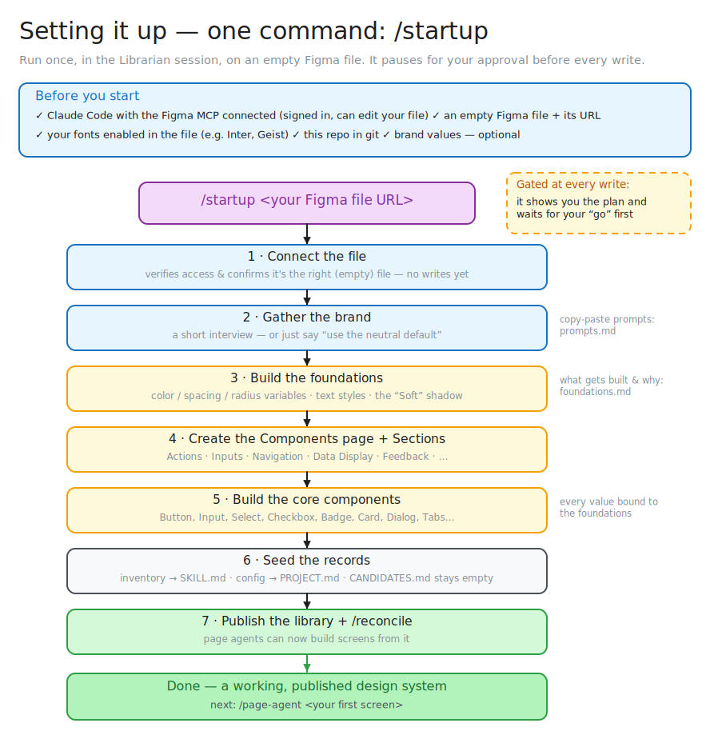
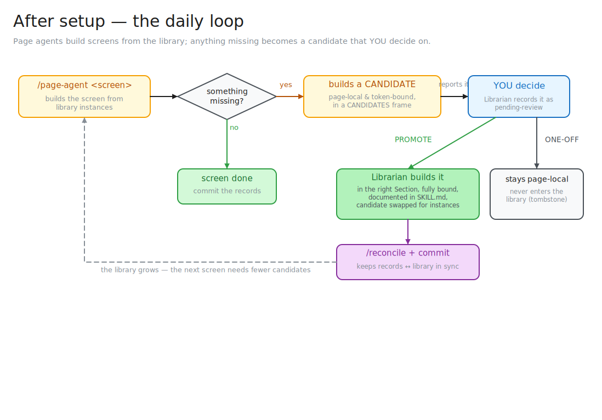

# Setting Up Your Figma Design Team — The Illustrated Guide

This is the plain-language walkthrough of the whole system: what the team is, how to set it up on
a brand-new Figma file, and what your day-to-day looks like afterwards. It condenses
[startup.md](startup.md), [workflow.md](workflow.md), [prompts.md](prompts.md), and the rules in
[CLAUDE.md](../CLAUDE.md) into one place. Every diagram below is an Excalidraw drawing — the
editable `.excalidraw` sources live next to the SVGs in [diagrams/](diagrams/), so you can open
any of them at [excalidraw.com](https://excalidraw.com) and change them.

---

## 1. What you're setting up

You are standing up a small **AI design team** that builds a real, token-driven design system in
your Figma file — and then keeps building screens with it. The team has three kinds of members:

- **You** — the design lead. You approve plans before anything is written to Figma, and you make
  every "should this go in the library?" decision. Agents never decide that for you.
- **The Librarian** — one long-lived Claude Code session. It is the **only** member allowed to
  touch anything shared: components, variables, text styles, publishing, and the record files in
  this repo.
- **Page agents** — throwaway Claude Code sessions, one per screen. They build screens using
  *instances* of the library's components, and they are never allowed to change the library itself.



Why so strict about who writes what? Because in Figma, components, variables, and styles are
**file-global** — a change made from any page is instantly seen by every other page. If two agents
edited the library at once, they'd trample each other. So the library gets exactly one writer (the
Librarian), and everyone else consumes it. Pages isolate *layouts*, not the library.

Three small text files in this repo act as the team's memory, and they're worth knowing by name:

| File | What it holds |
|---|---|
| [`PROJECT.md`](../PROJECT.md) | Everything file-specific: the Figma file key, the library page, its Sections, your brand values |
| `SKILL.md` (inside the skill) | The living inventory — every component in the library, documented |
| [`CANDIDATES.md`](../CANDIDATES.md) | The register of proposed components and what you decided about each |

Git tracks these files; the actual components live in Figma. Your commit history becomes a
changelog of *decisions*, which is exactly what you want.

---

## 2. Before you start — the checklist

Five things, most of which you already have:

1. **Claude Code with the Figma MCP connected**, signed in to an account that can **edit** your
   file. (If `use_figma` and `get_metadata` show up as available tools, you're set.)
2. **An empty Figma file** and its **URL**. Just create a new file in Figma and copy the link —
   the setup pulls the file key out of it.
3. **Your fonts enabled in that Figma file** (e.g. Inter, plus a heading font like Geist). This is
   the one people trip on: Figma can't create a text style for a font it can't load, so enable the
   fonts *before* you bootstrap. Details in [foundations.md](foundations.md).
4. **Git** — this template is already a repo; nothing to do unless you cloned it oddly.
5. *(Optional)* **Your brand** — a primary color, fonts, maybe a logo or screenshot. Don't have
   one? Fine. The team ships a clean neutral default, and because everything is token-bound,
   rebranding later is a one-variable edit, not a rebuild.

---

## 3. Setup — one command does it

Open Claude Code in this project, tell it **"you are the Librarian"**, and run:

```
/startup <paste your Figma file URL>
```

That's the whole setup, mechanically. The command walks seven steps, and — importantly — it is
**gated**: before every write it shows you exactly what it's about to create and waits for your
"go". You're never surprised by what lands in your file.



What each step means in practice:

1. **Connect the file** — it verifies it can reach and edit your file, and reports what's inside
   so you can confirm it's the right (empty) one. Nothing is written yet.
2. **Gather the brand** — a short interview: primary color, fonts, spacing, whether you want dark
   mode. Answer what you know and say *"everything else, use the default"*. If you'd rather
   copy-paste a ready-made answer (full brand spec, just-a-color, extract-from-logo, or
   nothing-yet), [prompts.md](prompts.md) has one for every situation.
3. **Build the foundations** — the design tokens: color variables, the spacing scale, radii, text
   styles, and a "Soft" card shadow. This always comes **before** components, because a component
   built first would bake in raw values you'd have to undo later.
4. **Create the Components page + Sections** — one page that will be the library, organized into
   Sections (Actions, Inputs, Navigation, Data Display, …).
5. **Build the core components** — the minimum set that makes real screens buildable: Button,
   Input, Select, Checkbox, Badge, Card, Dialog, Tabs, and friends — every value bound to the
   foundations from step 3.
6. **Seed the records** — the component inventory goes into `SKILL.md`, your file key/Sections/
   brand go into `PROJECT.md`, and `CANDIDATES.md` starts empty.
7. **Publish + hand off** — the library is published so page agents can use it, and one
   `/reconcile` pass confirms the records match the file.

Don't try to build everything up front — a **lean core** is the point. The library grows on demand
through the candidate flow below.

**The three answers worth getting right in step 2** (everything else can safely default):
your **fonts** (retrofitting text styles is painful), your **spacing scale** (everything binds to
it), and **whether you want dark mode** (cheap to include now, more work to add later).

---

## 4. After setup — the daily loop

Bootstrap is once. From then on, your rhythm looks like this: keep the Librarian session open, and
spin up a disposable page agent for each screen you want built:

```
/page-agent <screen name>
```



The page agent builds the screen from library instances. When it hits something the library
doesn't have yet — early on, that's often — it doesn't stop and it doesn't touch the library.
Instead it builds a **candidate**: a page-local, token-bound version of the missing piece, placed
in a `CANDIDATES` frame on its own page, and reports it to you.

Then the one human decision in the loop — for each candidate, **you** choose:

- **Promote** — it deserves to be a real library component. The Librarian builds it properly in
  the right Section, binds everything to tokens, documents it in `SKILL.md`, and swaps the page's
  local copy for real instances.
- **One-off** — it's fine for this screen but doesn't belong in the library. It stays where it is,
  gets marked as a tombstone, and is never surfaced again.

After promotions (or any library edit), the Librarian runs `/reconcile` to make sure the records
and the live file agree, and you commit. Expect **lots of candidates in the first week** — that's
the library filling out, not a problem — and expect it to quiet down as the core matures. Duplicate
candidates from different pages are normal too; you dedup them when you review.

---

## 5. Things that save you pain (learned the hard way)

- **Foundations before components, always.** A component built before its tokens exist carries raw
  values you'll have to retrofit. `/startup` enforces the order — don't shortcut it.
- **One Librarian at a time, and no page agents during bootstrap.** The single-writer rule is the
  whole safety model.
- **Don't trust "everything's bound" — verify.** Before promoting a candidate or publishing, have
  the Librarian read the actual nodes and confirm zero raw values.
- **The task list doesn't survive across sessions.** A page agent's *report to you* is the real
  candidate handoff; make sure the Librarian records it in `CANDIDATES.md` promptly.
- **Commit after each decision** — a promotion, a foundations change, the whole bootstrap. The
  repo is your decision log; Figma holds the artwork.
- **Unsure about the brand? Take the default.** Swapping the primary color or a font later is a
  token edit that re-flows everywhere. Retrofitting raw values is the expensive path.

---

## 6. Where to go deeper

| You want… | Read |
|---|---|
| The full day-zero walkthrough | [startup.md](startup.md) |
| Copy-paste prompts for the brand interview | [prompts.md](prompts.md) |
| What the foundations are and how they're built | [foundations.md](foundations.md) |
| The daily-loop cheat sheet | [workflow.md](workflow.md) |
| The team rules (who may write what) | [CLAUDE.md](../CLAUDE.md) |
| The file-specific config | [PROJECT.md](../PROJECT.md) |

*Diagrams: the `.svg` files embedded above are rendered from the matching `.excalidraw` sources in
[diagrams/](diagrams/) — open any of them at [excalidraw.com](https://excalidraw.com) (menu → Open,
or paste the JSON) to edit, then re-export.*
